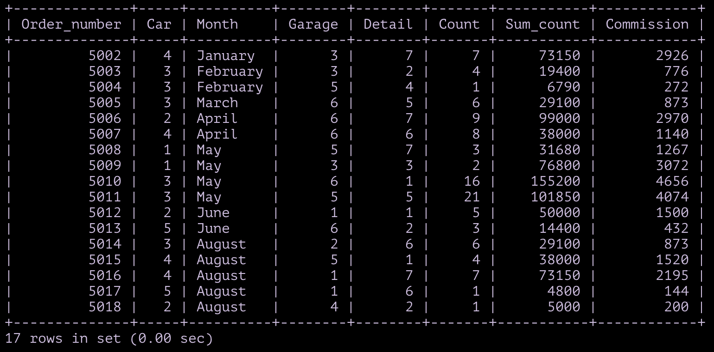
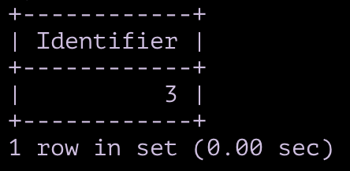
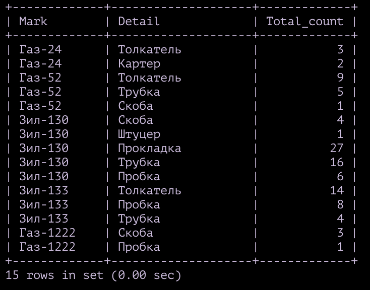

# Володин_Илья_Вар_9

## №1

```sql
CREATE TABLE Car (
    Identifier TINYINT UNSIGNED PRIMARY KEY AUTO_INCREMENT, 
    Mark VARCHAR (8) NOT NULL, 
    ATP_owner CHAR (4) NOT NULL,
    Discount TINYINT UNSIGNED CHECK (Discount <= 100) 
);
ALTER TABLE Car AUTO_INCREMENT = 1; 

CREATE TABLE Garage (
    Identifier TINYINT UNSIGNED PRIMARY KEY AUTO_INCREMENT, 
    Number VARCHAR (2) NOT NULL, 
    Location CHAR (4) NOT NULL, 
    Commission TINYINT UNSIGNED CHECK (Commission <= 100)
);
ALTER TABLE Car AUTO_INCREMENT = 1; 

CREATE TABLE Details (
    Identifier TINYINT UNSIGNED PRIMARY KEY AUTO_INCREMENT, 
    Detail VARCHAR (100) UNIQUE NOT NULL, 
    Seller CHAR (4) NOT NULL,
    Cost MEDIUMINT UNSIGNED NOT NULL,
    Max_count SMALLINT UNSIGNED NOT NULL
);
ALTER TABLE Details AUTO_INCREMENT = 1;

CREATE TABLE Repair (
    Order_number SMALLINT UNSIGNED PRIMARY KEY AUTO_INCREMENT,
    Car TINYINT UNSIGNED NOT NULL, 
    Date DATE NOT NULL,
    Garage TINYINT UNSIGNED NOT NULL,
    Detail TINYINT UNSIGNED NOT NULL,
    Count SMALLINT UNSIGNED NOT NULL,
    Sum_count MEDIUMINT UNSIGNED NOT NULL,
    FOREIGN KEY (Car) REFERENCES Car (Identifier),
    FOREIGN KEY (Garage) REFERENCES Garage (Identifier),
    FOREIGN KEY (Detail) REFERENCES Details (Identifier)
);
ALTER TABLE Repair AUTO_INCREMENT = 5002;

/* ___Объяснения:___

 - Везде, где есть `AUTO_INCREMENT`: 
В таблице мало значений, потому tiny (в _Repair_ SMALL, так как значения от 5001), это id, он > 0, 
значит UNSIGNED, AUTO_INCREMENT - потому что id инкримируется - не нужно указывать при заполнении.
После таблицы указывается начальное значение id, взято из таблицы.

- Везде, где есть `CHAR/VARCHAR`:
char: Длина данных в исходной таблице не меняется.
varcahr: Длина данных меняется, значение взято или как максимальная длина, или с запасом.

- Везде, где есть `CHECK`:
Проценты варьируются от 0 до 100, нижняя граница задается UNSIGNED, верхняя - CHECK.

- В таблице _Detail_ `UNIQUE`:
 Товары (Detail) не должны повторяться.

- В таблице _Repair_ `FOREIGN KEY`: 
Столбцы ссылаются на идентификаторы из других таблиц

- `NOT NULL` - просто чтобы все было заполнено, idk */
```

___No Results___

## №2

```sql
INSERT INTO Car (Mark, ATP_owner, Discount) VALUES
('Газ-24', 'АТП1', '4'),
('Газ-52', 'АТП1', '0'),
('Зил-130', 'АТП3', '3'),
('Зил-133', 'АТП4', '5'),
('Газ-1222', 'АТП5', '4');

INSERT INTO Garage (Number, Location, Commission) VALUES
('N1', 'АТП1', '3'),
('N2', 'АТП1', '3'),
('N1', 'АТП2', '4'),
('N3', 'АТП2', '4'),
('N4', 'АТП4', '4'),
('N5', 'АТП5', '3');

INSERT INTO Details (Detail, Seller, Cost, Max_count) VALUES
('Трубка', 'АТП1', '10000', '100'),
('Скоба', 'АТП1', '5000', '230'),
('Картер', 'АТП3', '40000',	'70'),
('Штуцер', 'АТП2', '7000', '200'),
('Прокладка', 'АТП2', '5000', '1200'),
('Пробка', 'АТП1', '5000', '300'),
('Толкатель', 'АТП1', '11000', '120');

INSERT INTO Repair (Car, Date, Garage, Detail, Count, Sum_count) VALUES
('004', '2022-01-01', '003', '007', '7', '77000'),
('003',	'2022-02-01', '003', '002', '4', '20000'),
('003',	'2022-02-01', '005', '004', '1', '7000'),
('003', '2022-03-01', '006', '005', '6', '30000'),
('002', '2022-04-01', '006', '007', '9', '99000'),
('004', '2022-04-01', '006', '006','8', '40000'),
('001', '2022-05-01', '005', '007','3', '33000'),
('001', '2022-05-01', '003', '003', '2', '80000'),
('003', '2022-05-01', '006', '001', '16', '160000'),
('003', '2022-05-01', '005', '005', '21', '105000'),
('002', '2022-06-01', '001', '001', '5', '50000'),
('005', '2022-06-01', '006', '002', '3', '15000'),
('003', '2022-08-01', '002', '006', '6', '30000'),
('004', '2022-08-01', '005', '001', '4', '40000'),
('004', '2022-08-01', '001', '007', '7', '77000'),
('005', '2022-08-01', '001', '006', '1', '5000'),
('002', '2022-08-01', '004', '002', '1', '5000');
```

___No Results___


## №3

```sql
SELECT * FROM Car;

SELECT * FROM Garage;

SELECT * FROM Details;

SELECT Order_number, Car, MONTHNAME(Date) AS Month ,Garage, Detail, Count, Sum_count FROM Repair;
```

___Result___


## №4

##### 4.C

```sql
SELECT Mark from Car;
```

___Result___


##### 4.D

```sql
SELECT DISTINCT Location, Commission FROM Garage;
```

___Result___


##### 4.E

```sql
SELECT Detail, Cost FROM Details;
```

___Result___


## №5

##### 5.C

```sql
SELECT Detail, Max_count FROM Details
WHERE Seller IN ('АТП1', 'АТП2');
```

___Result___


##### 5.D

```sql
SELECT Order_number, MONTHNAME(Date) AS Date, Count FROM Repair 
WHERE Sum_count > 30000
ORDER BY Sum_count, MONTH(Date);

```

___Result___


##### 5.E

```sql
SELECT Mark FROM Car
WHERE Mark LIKE "%ГАЗ%";
```

___Result___


## №6

##### 6.C

```sql
SELECT Repair.Order_number, Car.Mark, MONTHNAME(Repair.Date) AS Month, Repair.Sum_count 
FROM Repair INNER JOIN Car
    ON Repair.Car = Car.Identifier
ORDER BY Repair.Sum_count;
```

___Result___


##### 6.D

```sql
SELECT MONTHNAME(Repair.Date) AS Month, Garage.Number, Details.Detail,Repair.Count
FROM Repair INNER JOIN Garage
	ON Repair.Garage = Garage.Identifier
        INNER JOIN Details
	ON Repair.Detail = Details.Identifier;
```

___Result___


## №7

##### 7.C

```sql
SELECT Repair.Order_number, Car.Mark, MONTHNAME(Repair.Date) AS Month
FROM Repair INNER JOIN Car
    ON Repair.Car = Car.Identifier 
        INNER JOIN Garage
    ON Repair.Garage = Garage.Identifier
WHERE Garage.Location = 'АТП1';
```

___Result___


##### 7.D

```sql
SELECT Car.ATP_owner, Garage.Number, MONTHNAME(Repair.Date) AS Month
FROM Repair INNER JOIN Car
    ON Repair.Car = Car.Identifier
        INNER JOIN Garage
    ON Repair.Garage = Garage.Identifier
WHERE Car.Discount > 3 AND Repair.Date >= 2022-01-01
ORDER BY Repair.Date;
```

___Result___


##### 7.E

```sql
SELECT Car.Mark 
FROM Repair INNER JOIN Details
    ON Repair.Detail = Details.Identifier
        INNER JOIN Garage
    ON Repair.Garage = Garage.Identifier
        INNER JOIN Car
    ON Repair.Car = Car.Identifier
WHERE Details.Detail = 'Толкатель' AND NOT Garage.Number = 'N1';
```

___Result___


##### 7.F

```sql
SELECT Details.Detail, Repair.Count
FROM Repair INNER JOIN Car
    ON Repair.Car = Car.Identifier
        INNER JOIN Garage
    ON Repair.Garage = Garage.Identifier
        INNER JOIN Details
    ON Repair.Detail = Details.Identifier
WHERE Car.Mark = 'Зил-130' AND Garage.Location IN ('АТП2', 'АТП4');
```

___Result___


## №8

```sql
UPDATE Repair, Car
SET Repair.Sum_count = Repair.Sum_count - ROUND(Repair.Sum_count * Car.Discount / 100, 0)
WHERE Repair.Car = Car.Identifier;

SELECT Sum_count FROM Repair;
```

___Result___


>_Updated table Repair_
>

## №9

```sql
ALTER TABLE Repair ADD COLUMN Commission TINYINT UNSIGNED CHECK (Commission <= 100); 

UPDATE Repair, Garage 
SET Repair.Commission = Garage.Commission
WHERE Repair.Garage = Garage.Identifier;

SELECT Order_number, Car, MONTHNAME(Date) AS Month,
Garage, Detail, Count, Sum_count, Commission FROM Repair;
```

___Result___



## №10

##### 10.C

```sql
SELECT Garage.Identifier FROM Garage
    WHERE Garage.Identifier IN ( 
        SELECT Garage.Identifier 
        FROM Repair INNER JOIN Details
            ON Repair.Detail = Details.Identifier
                INNER JOIN Car 
            ON Repair.Car = Car.Identifier
                INNER JOIN Garage 
            ON Repair.Garage = Garage.Identifier
        WHERE Car.ATP_owner = 'АТП3' AND Details.Detail = 'Толкатель'
	);
```

___Result___ 

Пустая таблица


##### 10.D

```sql
SELECT Detail FROM Details
WHERE Identifier NOT IN
    (SELECT Identifier FROM Details, Repair
    WHERE Identifier = Repair.Detail AND MONTH(Date) IN
        (SELECT MONTH(Date) AS Month FROM Repair, Details
        WHERE Repair.Detail = Details.Identifier AND Details.Detail = 'Картер'));
```

___Result___


## №11

##### 11.C

```sql
SELECT Detail FROM Details
WHERE Cost = 
    (SELECT MAX(Cost) FROM Details
    WHERE 
        Identifier = ANY
        (SELECT Detail FROM Repair
        WHERE Car = 
            (SELECT Car FROM Repair
            WHERE Sum_count >= ALL (SELECT Sum_count FROM Repair))));
```

___Result___ 


##### 11.D

```sql
SELECT Mark, Discount FROM Car
WHERE ATP_owner = 'АТП1' AND 
Discount <= ALL (SELECT Discount FROM Car);
```

___Result___


##### 11.E

```sql
SELECT Details.Detail FROM Repair, Details
WHERE Repair.Detail = Details.Identifier AND
    Repair.Count >= ALL (SELECT Count FROM Repair);
```

___Result___ 


##### 11.F

```sql
SELECT Order_number, Car.Mark, MONTHNAME(Date) AS Date FROM Car, Repair, Garage
WHERE Car.Identifier = Repair.Car AND Garage.Identifier = Repair.Garage AND
    Location = ALL (SELECT Location FROM Garage WHERE Location = 'АТП1');
```

___Result___


## №12

```sql
SELECT Location, ATP_owner FROM Repair, Garage, Car
WHERE Repair.Car = Car.Identifier AND 
    Repair.Garage = Garage.Identifier

UNION ALL 

SELECT NULL, NULL WHERE NULL;
```

___Result___

Единственное применение UNION, которое я нашел :), зато работает


## №13
<!--TODO 13.C-->
##### 13.C

```sql
```

___Result___ 



##### 13.D

```sql
SELECT Identifier FROM Garage	
WHERE NOT EXISTS
    (
    SELECT DISTINCT Car.Identifier FROM Car
    WHERE 
        EXISTS 
            (SELECT * FROM Repair, Details
                WHERE Repair.Car = Car.Identifier AND Repair.Detail = Details.Identifier 
                    AND Details.Detail = 'Прокладка')
     
    INTERSECT
    
    SELECT DISTINCT Repair.Car FROM Repair
    WHERE Repair.Garage = Garage.Identifier 
    );
```

___Result___


##### 13.E

```sql
SELECT Detail FROM Details
WHERE EXISTS (
    SELECT DISTINCT Garage.Identifier FROM Garage
    WHERE Details.Seller = Garage.Location
    
    INTERSECT
    
    SELECT DISTINCT Garage.Identifier FROM Garage, Repair
    WHERE Repair.Garage = Garage.Identifier AND Repair.Detail = Details.Identifier
    );
```

___Result___ 


##### 13.F

```sql
SELECT Detail FROM Details
WHERE NOT EXISTS (
    SELECT DISTINCT * FROM Repair
    WHERE Details.Identifier = Repair.Detail AND Repair.Count < 2
);
```

___Result___


## №14

##### 14.C

```sql
SELECT Detail FROM Details 
WHERE Max_count = (SELECT MAX(Max_count) FROM Details);
```

___Result___ 


##### 14.D

```sql
SELECT AVG(Garage.Commission) AS Averange FROM Garage
WHERE NOT EXISTS (
        SELECT Car.Identifier FROM Car, Repair
        WHERE Repair.Car = Car.Identifier AND Repair.Garage = Garage.Identifier AND Garage.Location = Car.ATP_owner
        );
```

___Result___


##### 14.E

```sql
SELECT DISTINCT Car.Mark FROM Car, Repair, Garage
WHERE Repair.Car = Car.Identifier AND Repair.Garage = Garage.Identifier 
    AND Garage.Location IN ('АТП1', 'АТП2')
    AND Car.Discount = (SELECT MAX(Car.Discount) FROM Car);
```

___Result___ 


##### 14.F

```sql
SELECT COUNT(DISTINCT Car.Mark) AS Count FROM Car, Garage, Repair
WHERE Repair.Car = Car.Identifier AND Repair.Garage = Garage.Identifier 
    AND MONTH(Repair.Date) BETWEEN 6 AND 8 AND Garage.Location = 'АТП1';
```

___Result___


## №15

##### 15.C

```sql
SELECT Car.Mark, Details.Detail, SUM(Repair.Count) AS Total_count 
FROM Repair, Car, Details
WHERE Repair.Car = Car.Identifier AND Repair.Detail = Details.Identifier
GROUP BY Car.Mark, Details.Detail;
```

___Result___ 



##### 15.D

```sql
SELECT Details.Detail, COUNT(DISTINCT Car.Mark) AS Count FROM Car, Repair, Details
WHERE Repair.Car = Car.Identifier AND Repair.Detail = Details.Identifier AND Car.Discount > 3
GROUP BY Details.Detail;
```

___Result___


##### 15.E

```sql
SELECT Garage.Identifier, SUM(Repair.Sum_count) AS Total_sum FROM Garage, Repair
WHERE NOT EXISTS (
        SELECT Car.Identifier FROM Car, Repair
        WHERE Repair.Car = Car.Identifier AND Repair.Garage = Garage.Identifier 
            AND Garage.Location = Car.ATP_owner
        )
    AND Garage.Identifier = Repair.Garage
GROUP BY Garage.Identifier;
```

___Result___ 


##### 15.F

```sql
SELECT Car.Mark, MAX(Repair.Sum_Count) AS Max_Cost FROM Car, Garage, Repair
WHERE Repair.Garage = Garage.Identifier AND Repair.Car = Car.Identifier 
    AND Garage.Location = 'АТП2'
GROUP BY Car.Mark
HAVING Max_Cost < 70000;
```

___Result___


